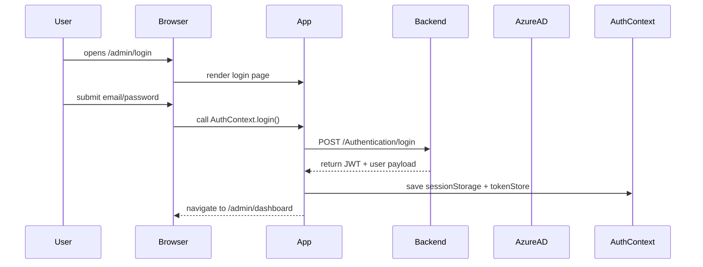
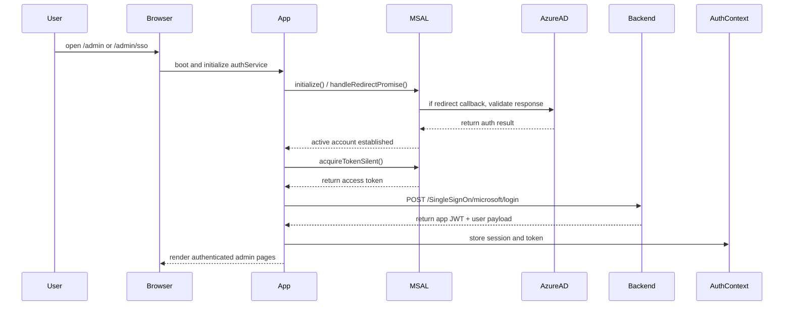

# System Architecture

## Overview

This project is a browser-based React single-page application built with Vite, TypeScript, and React Router. It supports two main user experiences:

- Public client-facing content pages
- Protected admin portal with authentication and authorization

The app is tenant-aware and supports multi-brand behavior based on the runtime hostname.

---

## Getting Started

### Install dependencies

```bash
npm install
```

### Start the app

```bash
npm run dev
```

The Vite dev server typically runs on `http://localhost:5173`.

### Visit tenant domains

This app changes branding and tenant headers by hostname.

- For **Mining**: use the mining hostname configured in `VITE_APP_ID` / `VITE_APP_ID` or local host mapping
- For **Agro**: use the hostname configured in `VITE_AGRO_DOMAIN` and `VITE_APP_AGRO_ID`

If you run locally, you can point both domains to `127.0.0.1` in your hosts file and then open the app in the browser using those hostnames.

Example local mapping for development:

```text
127.0.0.1 pk5mining.local
127.0.0.1 pk5agroallied.local
```

Then visit:

- `http://pk5mining.local:5173` for Mining
- `http://pk5agroallied.local:5173` for Agro

---

## Core Layers

### 1. Bootstrap and Global Providers

- `src/main.tsx`
  - Loads global CSS
  - Initializes MSAL SSO
  - Creates a global `QueryClient` for TanStack React Query
  - Wraps the app with `AuthProvider`
  - Renders the root `App`

### 2. App Shell

- `src/app/App.tsx`
  - Provides `BrowserRouter` for routing
  - Displays `ScrollToTop`, `Toaster`, `CookieBannerWithOptions`, and `LegalModalNew`
  - Uses `React.Suspense` fallback for lazy route loading
  - Updates document title and favicon dynamically from tenant config

### 3. Tenant / Branding

- `src/tenants/useTenant.ts`
  - Determines tenant by inspecting `window.location.hostname`
  - Switches between PK5 Agro-Allied and PK5 Mining Ltd
  - Provides tenant-specific:
    - app name
    - favicon
    - logo
    - color palette
    - `appId`

This tenant context is used in UI branding and request header composition.

---

## Routing Architecture

### Route Selection

- `src/app/routes/index.tsx`
  - Builds routes dynamically based on tenant and feature flags
  - Uses `VITE_ALLOW_ADMIN_FEATURES` to enable admin routes
  - Redirects invalid URLs to `/admin` or `/`

### Client Routes

- `src/app/routes/client-routes.tsx`
  - Public pages:
    - `/` → Home
    - `/about`
    - `/sustainability`
    - `/careers`
    - `/contact`
    - `/careers/job/:jobId`

### Admin Routes

- `src/app/routes/admin-routes.tsx`
  - `/admin/login`
  - `/admin/sso`
  - Protected `/admin` area with nested admin layout
  - Uses `ProtectedRoute` for authentication enforcement
  - Uses per-route role and permission guard `AdminAccessGuard`

---

## Authentication and Authorization

### Auth Context

- `src/app/context/AuthContext.tsx`
  - Maintains global auth state:
    - `user`
    - `isLoading`
    - `isAdmin`
    - `isAuthenticated`
  - Exposes auth actions:
    - `login(email, password)`
    - `logout()`
    - `setUser()`

### Session Restore

- Restores auth state from:
  - `tokenStore` (JWT bearer token)
  - `sessionStorage` (`AUTH_KEY` user payload)
- Validates token expiration via `isJwtExpired`
- Rehydrates authenticated state automatically

### SSO Flow

- `src/app/services/sso/authService.ts`
  - Wraps `@azure/msal-browser`
  - Handles MSAL initialization and redirect callback
  - Triggers login redirect
  - Retrieves access token silently
  - Logs out with redirect
- `src/app/config/sso/authconfig.ts`
  - Defines MSAL config from environment:
    - `clientId`
    - `authority`
    - `redirectUri` → `/admin/sso`
    - `postLogoutRedirectUri` → `/admin/login`
    - `scopes`

### Backend SSO Handshake

- `src/app/api/auth.ts`
  - `microsoftLogin()` calls `/SingleSignOn/microsoft/login`
  - The backend returns app-specific user/permission payload
  - The app stores the final JWT and user object

### Local Login Fallback

- `login()` calls `/Authentication/login`
- Supports mock auth via `VITE_USE_MOCK_AUTHENTICATION`

### Inactivity and Session Security

- Auth context sets 15-minute inactivity timeout
- Tracks user activity events and tab visibility
- Logs out on inactivity or cross-tab session loss
- Supports browser event `unauthorized` to force logout

---

## API Client Layer

- `src/app/api/http.ts`
  - Configures Axios with:
    - `baseURL` = `/api`
    - JSON headers
    - 15 second timeout
  - Request interceptor adds:
    - `Authorization: Bearer <token>`
    - Conditional API key header
    - `Application-Tenant` header from tenant `appId`
  - Response interceptor handles retries for:
    - timeouts
    - network errors
    - cancellations

This central HTTP layer is used by all API modules.

---

## API Service Modules

- `src/app/api/auth.ts`
  - `login()`
  - `changePassword()`
  - `microsoftLogin()`

- Other API modules in `src/app/api/` likely follow the same pattern:
  - job listings
  - departments
  - users
  - permissions
  - subsidiaries

These services encapsulate backend endpoints and normalize error handling.

---

## Security & Access Control

- `ProtectedRoute` ensures only authenticated users can access admin pages
- `AdminAccessGuard` verifies:
  - required role membership
  - required permissions
- `useAuth()` exposes auth state to components
- `AuthProvider` calculates `isAdmin` based on `USERROLES.superAdmin`

This allows fine-grained guard logic for admin route access.

---

## Key Architectural Patterns

- Multi-tenant browser behavior based on hostname
- Feature flag route inclusion (`VITE_ALLOW_ADMIN_FEATURES`)
- Lazy-loaded pages using `React.lazy`
- Centralized auth state in React context
- Unified Axios request/response handling
- SSO integration with MSAL + backend token handshake
- Inactivity-driven logout for session security

---

## Component / Flow Diagram

```text
[Browser] --> [React App]
                    |
                    +--> [App Shell] -> [AppRoutes]
                    |                      |
                    |                      +--> [Client Routes]
                    |                      |
                    |                      +--> [Admin Routes]
                    |
                    +--> [AuthProvider]
                    |          |
                    |          +--> [AuthContext]
                    |                 - session restore
                    |                 - inactivity timeout
                    |                 - login/logout
                    |
                    +--> [QueryClientProvider]
                    |
                    +--> [Tenant Service]
                               - branding
                               - tenant headers

[Admin Routes] --> [ProtectedRoute] --> [AdminAccessGuard] --> [AdminLayout / page components]

[AuthContext] --> [authService (MSAL)] --> [Azure AD]
                               |
                               +--> [Backend /SingleSignOn/microsoft/login]

[API Layer] --> [Axios http instance]
                 - Authorization header
                 - Tenant header
                 - retry logic
                 - error normalization

[Page components] --> [API service modules] --> [Backend API endpoints]

```

---

## Summary

The system is a multi-tenant React front-end with a strong focus on authentication and authorization. It cleanly separates:

- UI shell and routing
- auth state and SSO integration
- tenant-specific configuration
- backend API access

## Optional Architecture Diagrams

### Login Sequence Diagram



### SSO Handshake Sequence Diagram



These diagrams describe the two main authentication flows in the system.
